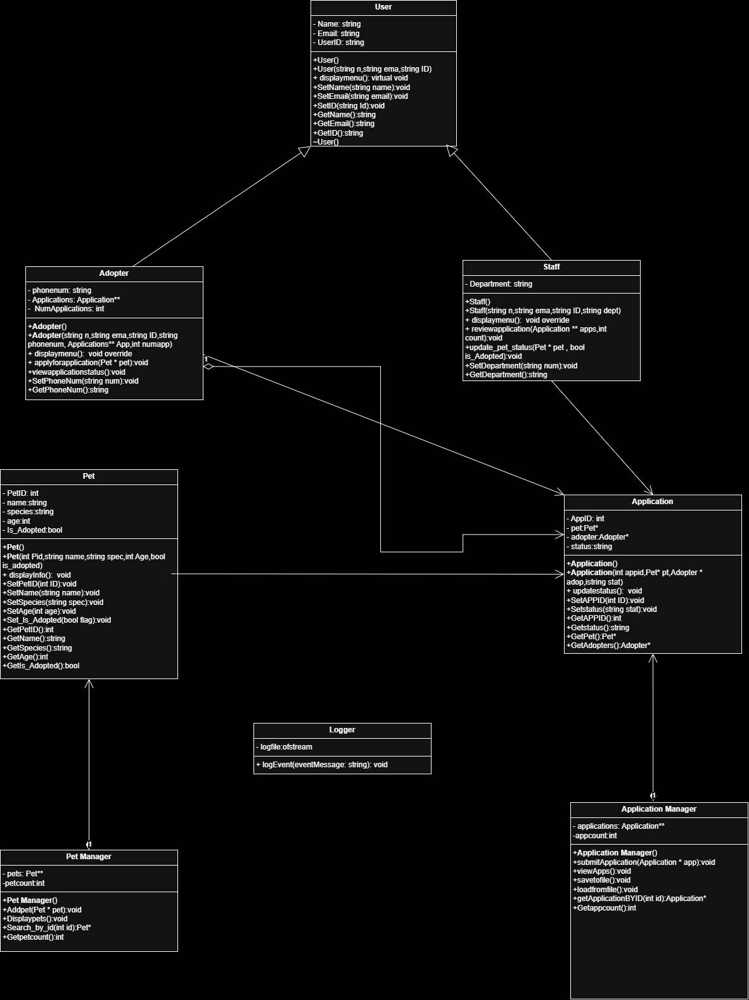

# PawConnect
PawConnect is a C++ application designed to simulate the operations of a pet adoption center using core Object-Oriented Programming (OOP) principles. The system manages interactions between two user roles — Adopters and Staff — allowing users to handle pet records and adoption processes in a structured, role-based environment.

Adopters can browse available pets, submit adoption applications, and track their application status. Staff members can add pets, review applications, approve or reject them, and update adoption statuses.

The project demonstrates key C++ OOP features such as inheritance, polymorphism, composition, aggregation, association, exception handling, template usage, logging, and data persistence through binary file handling. It avoids the use of STL containers like vector, relying instead on pointer-based dynamic memory management.

PawConnect serves as a comprehensive academic project that showcases practical implementation of object-oriented design in a real-world-inspired system.

## Architecture

### High-Level Diagram

---
### Core Ideas
- Simulates a real-world pet adoption process
- Two user roles: **Adopter** and **Staff**
- Demonstrates key OOP concepts like inheritance, composition, and polymorphism
- Data persistence using binary file handling
- Built without STL vectors using raw pointers and manual memory management
---
### Features
- Role-based login system
- Browse, add, and manage pet records
- Submit and review adoption applications
- Application status updates
- Data saved/restored across sessions
- Logging of key events
- Template-based utilities
---
### Concepts Used
- Inheritance & Polymorphism
  - Composition, Aggregation, Association
  - Exception Handling
  - Template Functions and Classes
  - Logging
  - Binary File Handling
  - Pointer-Based Memory Management

---
### UML

The UML diagram represents the core class structure of the PawConnect system. It shows relationships such as inheritance (between User, Adopter, and Staff), composition (PetManager and ApplicationManager), aggregation (Adopter → Application), and associations (Application with Pet and Adopter). Key class attributes and functions are also outlined to highlight system design and logic flow.
---
### Flow Chart

